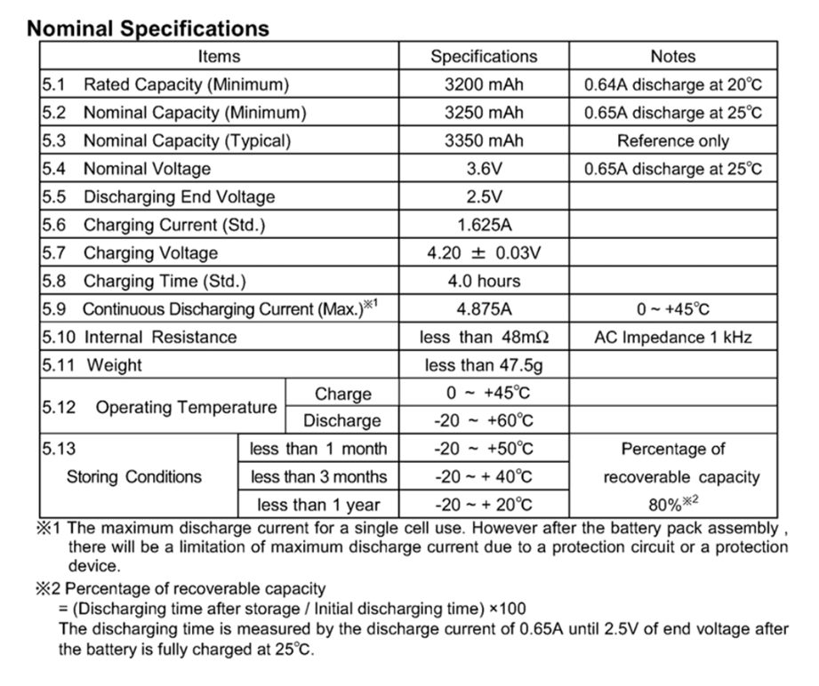

# r1 Mark I - Rover

## Electronics

### Microcontroller
Technical specifications:
- Model: [Arduino Leonardo]

#### Diagram
                                 .-----.
    .----[PWR]-------------------| USB |--.
    |                            '-----'  |
    |                                     |
    |                           A5/SCL[ ] |   C5
    |                           A4/SDA[ ] |   C4
    |                             AREF[ ] |
    |                              GND[ ] |
    | [ ]NC                     SCK/13[ ]~|   B5
    | [ ]v.ref                 MISO/12[ ] |   .
    | [ ]RST                   MOSI/11[ ]~|   .
    | [ ]3V3   +-----+              10[ ]~|   .
    | [ ]5v    |     |               9[ ]~|   .
    | [ ]GND   | MCU |               8[ ] |   B0
    | [ ]GND   |     |                    |
    | [ ]Vin   +-----+               7[ ] |   D7
    |                                6[ ]~|   .
    | [ ]A0                          5[ ]~|   .
    | [ ]A1                          4[ ] |   .
    | [ ]A2                     INT1/3[ ]~|   .
    | [ ]A3                     INT0/2[ ] |   .
    | [ ]A4/SDA  RST SCK MISO     TX>1[ ] |   .
    | [ ]A5/SCL  [ ] [ ] [ ]      RX<0[ ] |   D0
    |            [ ] [ ] [ ]              |
    '--.                         .--------'
       \_______________________/

Arduino Leonardo diagram by http://busyducks.com/ascii-art-arduinos

#### Pin designation
 id | pin |   type    | direction |               description
----|-----|-----------|-----------|--------------------------------------------
  0 |   0 | digital   | input     | Serial communication
  1 |   1 | digital   | output    | Serial communication
  2 |   0 | -         | -         | -
  3 |   1 | -         | -         | -
  4 |   - | -         | -         | -
  5 |   5 | -         | -         | -
  6 |   6 | -         | -         | -
  7 |   - | -         | -         | -
  8 |   - | -         | -         | -
  9 |   9 | -         | -         | -
 10 |  10 | -         | -         | -
 11 |  11 | -         | -         | -
 12 |   - | -         | -         | -
 13 |  13 | PWM       | output    | Status LED
 14 |     | -         | -         | -
 15 |   - | -         | -         | -
 16 |   - | -         | -         | -
 17 |   - | -         | -         | -
 18 |   - | -         | -         | -
 19 |   - | -         | -         | -

Driver A 1 / Motor AA 1
Driver A 2 / Motor AA 1
Driver A 3 / Motor AB 2
Driver A 4 / Motor AB 2
Driver B 1 / Motor BA 3
Driver B 2 / Motor BA 3
Driver B 3 / Motor BB 4
Driver B 4 / Motor BB 4

### Battery

---
[Main page]: ../README.md
[Arduino Leonardo]: https://www.arduino.cc/en/Main/arduinoBoardLeonardo/#techspecs
